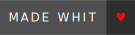

<h1 align="center" >
       What's up, I'm Sebastian 
        

       
 
               

      
  
   

### About me 👨‍💻 ###
This is my portfolio web: https://sb4ss.vercel.app/
- I'm 20 years old  
- I'm studying systems engineering 💻
- Participant in the hackatoon 2024 in the city of Cali, organized by fedesoft - cenisoft - NIDO.
- I ♥ Basketball
- I have been learning autonomously programming for about two years.
- I'm a student of programming at the Politecnico Internacional de Occidente in Cali, Colombia. 
- I ♥ Clean Code and hexagonal architecture.  
- I would like to learn low-level programming by 2026. 

### My tech Stack 💻 ###

            

 
       
       

       
       
       
       
       
       

### Extras and frameworks 🔥 ### 

       

       
       
       

       
       
       
       

       
       
       

       
       
       
       
        

       
       
       
        
        

 

  

  
 

 
 

   

