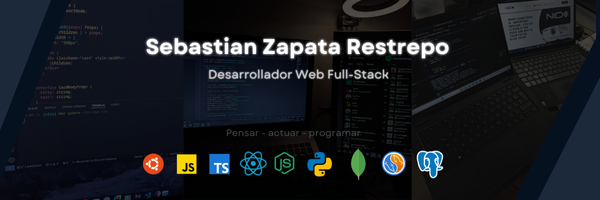

<h1 align="center" >
       What's up, I'm Sebastian 
        

  

### About me 👨‍💻 ###
This is my portfolio web: https://portfolio-sebastianzapata123s-projects.vercel.app/
- I'm 19 years old 
- I'm about to start my studies as a systems engineer 💻
- Participant in the hackatoon 2024 in the city of Cali, organized by fedesoft - cenisoft - NIDO.
- I ♥ Basketball
- I have been learning autonomously programming for about a year now.
- I am a student of programming at the Politecnico Internacional de Occidente in Cali, Colombia. 

### My tech Stack 💻 ###

