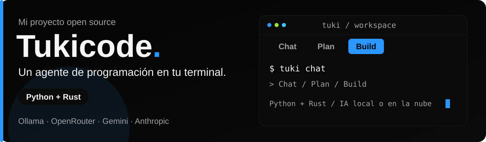
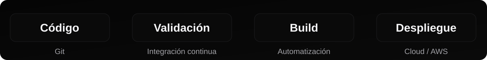

<picture>
  <source media="(max-width: 600px) and (prefers-color-scheme: dark)" srcset="./assets/header-mobile-dark.svg">
  <source media="(max-width: 600px)" srcset="./assets/header-mobile-light.svg">
  <source media="(prefers-color-scheme: dark)" srcset="./assets/header-dark.svg">
  
</picture>

<b>Full-stack · Cloud · DevOps · Agentes de IA</b> Aprender, construir y compartir. Desde Cali, Colombia.

## 👨‍💻 Detrás del código

Soy **Sebastián**, desarrollador full-stack y principal contribuidor de [Tukicode](https://github.com/tuki-labs/tukicode). Me gusta conectar una buena interfaz con un backend claro, automatizar lo repetitivo y construir herramientas que hagan más fácil desarrollar software.

Mi enfoque combina **clean code, arquitectura hexagonal y aprendizaje autónomo**, con conocimientos en **AWS, DevOps e integración y entrega continuas (CI/CD)**.

- 🎓 Estudio **Ingeniería de Sistemas** y programación en el **Politécnico Internacional de Occidente**.
- 🛠️ Construyo aplicaciones web y exploro **Rust, microservicios y programación de bajo nivel**.
- 🏆 Participé en el **hackathon de Cali 2024**, organizado por Fedesoft, Cenisoft y NIDO.
- 🏀 Cuando cierro la terminal, también hay espacio para el **baloncesto**.

## 🦜 Tukicode: IA que trabaja desde tu terminal

<a href="https://github.com/tuki-labs/tukicode">
<picture>
  <source media="(max-width: 600px) and (prefers-color-scheme: dark)" srcset="./assets/tukicode-mobile-dark.svg">
  <source media="(max-width: 600px)" srcset="./assets/tukicode-mobile-light.svg">
  <source media="(prefers-color-scheme: dark)" srcset="./assets/tukicode-dark.svg">
  
</picture>
</a>

**Tukicode** es un agente de programación CLI de código abierto que ayuda a ejecutar tareas de desarrollo desde la terminal. Combina una arquitectura asíncrona en **Python** con un motor nativo en **Rust** para operaciones de archivos, búsqueda de código y terminal.

### Tres modos, según lo que necesitas

- **Chat:** preguntas, explicaciones y arreglos puntuales.
- **Plan:** revisa un plan antes de ejecutar tareas de varios pasos.
- **Build:** ejecuta el plan para construir proyectos de forma autónoma.

### Lo que hay bajo el capó

- **IA local o en la nube:** Ollama, OpenRouter, Gemini y Anthropic.
- **Herramientas en paralelo:** ejecución asíncrona y procesamiento simultáneo.
- **Una terminal completa:** TUI con chat, explorador de archivos y consola; soporte de PTY y procesos en segundo plano.
- **Contexto y planificación:** compresión de memoria, prompt caching y planes estructurados.
- **Multiplataforma:** Windows, macOS y Linux.

> Me interesa acercar la IA al trabajo real de desarrollo: comprender el proyecto, planear y ejecutar con herramientas, desde el mismo lugar donde programamos.

**[Ver el código](https://github.com/tuki-labs/tukicode)** · **[Descargar la última versión](https://github.com/tuki-labs/tukicode/releases/latest)** · **[Documentación en español](https://github.com/tuki-labs/tukicode/blob/main/README.es.md)**

## ⚡ Stack y conocimientos

### Interfaces y experiencia web

      

### Backend, lenguajes y datos

       

### Cloud, DevOps y CI/CD

       

Conocimientos en **AWS y prácticas DevOps**, con foco en automatizar validaciones, builds y despliegues mediante pipelines de **CI/CD**.

<picture>
  <source media="(max-width: 600px) and (prefers-color-scheme: dark)" srcset="./assets/delivery-mobile-dark.svg">
  <source media="(max-width: 600px)" srcset="./assets/delivery-mobile-light.svg">
  <source media="(prefers-color-scheme: dark)" srcset="./assets/delivery-dark.svg">
  
</picture>

<b>Más herramientas de mi entorno</b>

HTML, CSS, Bootstrap, Ubuntu, Visual Studio Code, ESLint, Netlify, Arduino, Arduino IDE, Notion, Trello y Jira.

## 📊 Actividad y constancia

Contribuciones de los últimos 12 meses, con una animación que recorre mi actividad. **Actualización automática diaria**, con versiones clara y oscura.

<picture>
  <source media="(prefers-color-scheme: dark)" srcset="./assets/contributions-dark.svg">
  
</picture>

<picture>
<source media="(prefers-color-scheme: dark)" srcset="https://github-profile-summary-cards.vercel.app/api/cards/profile-details?username=sb4ss&amp;theme=github_dark">

</picture>

## 🤝 Sigamos construyendo

Me interesan las **herramientas para desarrolladores, los agentes de IA, las aplicaciones web y la automatización**. Puedes explorar lo que construyo o seguir lo que comparto:

<b>Pensar. Actuar. Programar.</b> El próximo paso siempre puede ser una buena idea convertida en código.

