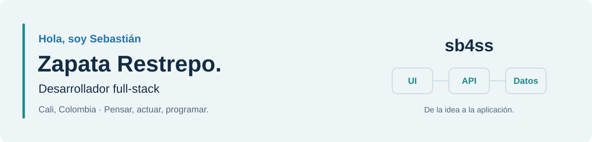

<picture>
  <source media="(max-width: 600px) and (prefers-color-scheme: dark)" srcset="./assets/header-mobile-dark.svg">
  <source media="(max-width: 600px)" srcset="./assets/header-mobile-light.svg">
  <source media="(prefers-color-scheme: dark)" srcset="./assets/header-dark.svg">
  <source media="(prefers-color-scheme: light)" srcset="./assets/header-light.svg">
  
</picture>

  <a href="https://sb4ss.vercel.app/">Portafolio</a> &nbsp; / &nbsp;
  <a href="https://sb4ss-blog.vercel.app/">Blog</a> &nbsp; / &nbsp;
  <a href="https://github.com/sb4ss?tab=repositories">Repositorios</a>

## Hola, soy Sebastián

Soy desarrollador full-stack en Cali, Colombia. Me gusta construir aplicaciones web, entender cómo funcionan y mantener el código claro. El aprendizaje autónomo, el clean code y la arquitectura hexagonal forman parte de mi manera de acercarme al software.

- **Formación:** estudiante de Ingeniería de Sistemas y de programación en el Politécnico Internacional de Occidente.
- **Experiencia:** participante del hackathon de 2024 en Cali, organizado por Fedesoft, Cenisoft y NIDO.
- **Explorando:** Rust, programación de bajo nivel y microservicios.
- **Fuera del código:** baloncesto.

## Proyectos seleccionados

### TaskFlow

Organiza tareas y proyectos para facilitar el trabajo en equipo. [Frontend](https://github.com/sb4ss/taskflow-frontend) · [Backend](https://github.com/sb4ss/taskflow-backend)

### Coffe AI

Interfaz para conversar con un modelo generativo de texto. [Frontend](https://github.com/sb4ss/coffeai-front) · [Backend](https://github.com/sb4ss/coffeaibackend)

### Pynasa

Proyecto alrededor de una biblioteca de Python para interactuar con la API de la NASA. [Repositorio](https://github.com/sb4ss/pynasa)

## Tecnologías

### Frontend

      

### Backend y datos

      

### Entorno de trabajo

    

  
Otras herramientas que he utilizado

HTML, CSS, Bootstrap, Ubuntu, Arduino y Arduino IDE, Visual Studio Code, Netlify, Notion, Trello y Jira.

## Actividad en GitHub

Mi calendario de contribuciones de los últimos 12 meses, convertido en una animación. Se actualiza diariamente e incluye etiquetas de los meses.

<picture>
  <source media="(prefers-color-scheme: dark)" srcset="./assets/contributions-dark.svg">
  <source media="(prefers-color-scheme: light)" srcset="./assets/contributions-light.svg">
  
</picture>

## Conecta conmigo

Puedes conocer más sobre mi trabajo en el [portafolio](https://sb4ss.vercel.app/), leer lo que comparto en mi [blog](https://sb4ss-blog.vercel.app/) o explorar mis [repositorios](https://github.com/sb4ss?tab=repositories).

**Pensar, actuar, programar.**

